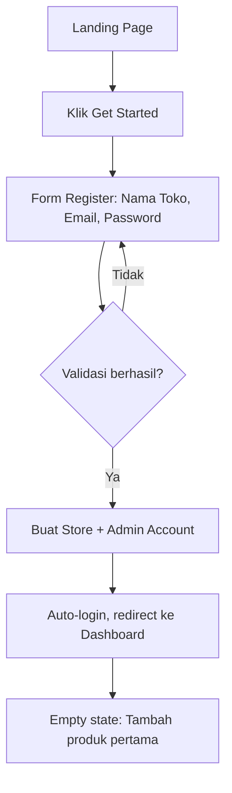
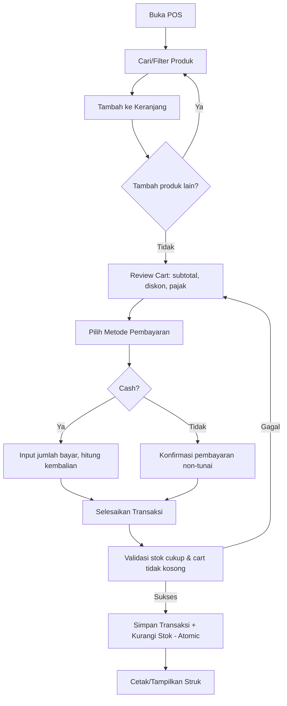
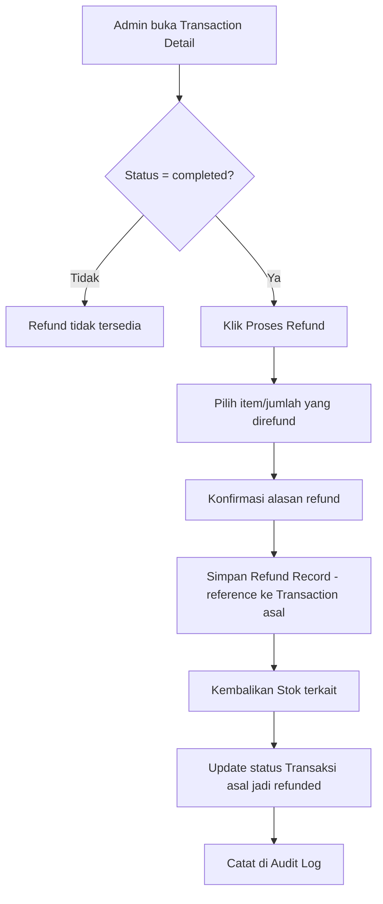

# PRD.md — OpenPOS Product Requirements Document

**Version:** 1.0 (MVP)
**Status:** Ready for Development
**Related documents:** `Architecture.md`, `Schema.md`, `Rules.md`, `Design.md`

---

## 1. Product Overview

OpenPOS adalah aplikasi **Point of Sale (POS) berbasis web yang 100% gratis selamanya**, dirancang khusus untuk UMKM (toko kelontong, toko pakaian, toko elektronik kecil, toko kosmetik, minimarket kecil, toko accessories, dan usaha retail sejenis).

OpenPOS memungkinkan pemilik usaha kecil untuk mendaftar, menyiapkan toko, mengelola produk dan stok, melakukan transaksi penjualan melalui antarmuka kasir modern, serta memantau performa bisnis melalui laporan — semuanya tanpa biaya langganan.

## 2. Vision

> **Membuat sistem kasir modern yang mudah digunakan siapa saja, dapat diakses kapan saja, dan tetap gratis tanpa biaya berlangganan.**

Filosofi produk:

> **Simple enough for anyone, powerful enough for a growing business.**

OpenPOS harus terasa sederhana, cepat, modern, profesional, dan mudah dipahami pengguna awam — bukan software enterprise yang rumit.

## 3. Problem Statement

UMKM di Indonesia sebagian besar masih mencatat penjualan secara manual (buku kas, Excel, atau tanpa pencatatan sama sekali). Ini menyebabkan:

- Tidak ada visibilitas real-time terhadap stok barang, sehingga sering kehabisan stok atau overstock.
- Tidak ada data penjualan yang akurat untuk pengambilan keputusan bisnis.
- Solusi POS komersial yang ada umumnya berbayar per bulan, dengan biaya yang memberatkan usaha kecil dengan margin tipis.
- Software POS enterprise yang tersedia gratis (jika ada) biasanya terlalu kompleks untuk pengguna awam.

OpenPOS menyelesaikan masalah ini dengan menyediakan sistem kasir yang **gratis selamanya**, **sederhana**, dan **cukup kuat** untuk operasional harian toko kecil.

## 4. Goals

- **G1:** Menyediakan alur kasir (POS) yang cepat — kasir dapat menyelesaikan satu transaksi dalam langkah minimal.
- **G2:** Menyediakan pengelolaan produk, kategori, dan stok yang akurat dan real-time.
- **G3:** Menjamin integritas data — stok dan transaksi harus selalu konsisten, tidak boleh ada race condition atau data korup.
- **G4:** Menyediakan role-based access control yang tegas antara Admin dan Kasir, ditegakkan di backend, bukan hanya UI.
- **G5:** Menyediakan laporan bisnis dasar (penjualan, profit, stok) yang dapat diekspor.
- **G6:** Arsitektur harus future-ready untuk multi-store, offline mode, dan realtime sync tanpa rewrite besar.
- **G7:** Aplikasi dapat digunakan lintas device (desktop, tablet, mobile) secara bersamaan dalam satu toko.
- **G8:** Biaya operasional infrastruktur harus efisien agar layanan dapat tetap gratis untuk pengguna.

## 5. Non-Goals (MVP)

- Tidak membangun sistem khusus restoran/cafe (table management, kitchen display, split bill kompleks).
- Tidak membangun multi-store / multi-branch pada MVP.
- Tidak membangun sistem loyalty/membership/poin pelanggan.
- Tidak membangun CRM kompleks.
- Tidak membangun supplier management atau purchase order.
- Tidak membangun offline-first POS pada MVP (namun arsitektur harus mendukung penambahan ini di masa depan).
- Tidak membangun native mobile/desktop app pada MVP.
- Tidak membangun sistem pembayaran custom (payment gateway integration mendalam) — MVP mencatat metode pembayaran, bukan memproses pembayaran elektronik secara langsung.
- Tidak ada model bisnis subscription/pricing tier.

## 6. Target Users

### 6.1 Primary Persona: UMKM Retail

Pemilik atau pengelola toko retail skala kecil-menengah: toko kelontong, toko pakaian, toko elektronik kecil, toko kosmetik, minimarket kecil, toko accessories.

### 6.2 Personas

**Persona 1 — Admin (Pemilik Toko / "Bu Sari")**
- Usia 30–50 tahun, pemilik toko kelontong/pakaian kecil.
- Tidak terlalu melek teknologi, terbiasa mencatat manual di buku.
- Ingin tahu omzet harian tanpa harus menghitung manual.
- Perlu kontrol penuh atas stok dan siapa yang bisa mengakses apa.
- Mengelola 1–3 kasir.

**Persona 2 — Kasir ("Andi")**
- Usia 18–30 tahun, karyawan paruh waktu/penuh waktu.
- Butuh alur transaksi yang cepat saat toko ramai.
- Tidak perlu (dan tidak boleh) mengakses data sensitif toko.
- Menggunakan device yang sama setiap shift (tablet/laptop di meja kasir).

## 7. User Stories

| ID | As a | I want to | So that |
|---|---|---|---|
| US-001 | Admin | mendaftar dan membuat toko baru | saya bisa mulai menggunakan OpenPOS |
| US-002 | Admin | menambahkan produk dengan harga dan stok awal | produk siap dijual |
| US-003 | Kasir | mencari produk dengan cepat saat transaksi | pelanggan tidak menunggu lama |
| US-004 | Kasir | menambahkan produk ke keranjang dan memproses pembayaran | transaksi selesai dengan struk |
| US-005 | Admin | melihat laporan penjualan harian | saya tahu performa toko hari ini |
| US-006 | Admin | melakukan penyesuaian stok dengan alasan yang jelas | stok selalu akurat |
| US-007 | Admin | membuat akun kasir baru | karyawan baru bisa mulai bekerja |
| US-008 | Admin | membatasi apa yang bisa diakses kasir | data sensitif toko aman |
| US-009 | Kasir | mencetak atau mengirim struk digital | pelanggan mendapat bukti transaksi |
| US-010 | Admin | melakukan refund pada transaksi yang salah | stok dan laporan tetap akurat |
| US-011 | Admin | mengekspor data produk dan transaksi | saya bisa analisis lebih lanjut di luar sistem |
| US-012 | Admin | mengganti mode terang/gelap | nyaman digunakan di kondisi apapun |
| US-013 | Admin | menggunakan OpenPOS dari laptop dan kasir dari tablet secara bersamaan | operasional toko tidak terganggu |

## 8. User Journey

**Journey: Onboarding toko baru → transaksi pertama**

1. Pemilik toko membuka landing page OpenPOS → klik "Get Started".
2. Mengisi form registrasi (email, password, nama toko) → akun Admin & toko dibuat.
3. Diarahkan ke dashboard (kosong) dengan panduan singkat: "Tambah produk pertama Anda".
4. Admin menambahkan beberapa produk beserta stok awal.
5. Admin (opsional) membuat akun kasir untuk karyawan.
6. Admin/Kasir membuka menu POS.
7. Kasir mencari produk, menambah ke keranjang, memilih metode pembayaran, menyelesaikan transaksi.
8. Struk dicetak/ditampilkan.
9. Stok otomatis berkurang, transaksi tercatat.
10. Admin melihat dashboard — omzet dan transaksi hari ini sudah terupdate.

## 9. Product Scope

### 9.1 In Scope (MVP)
Landing page, autentikasi, dashboard, POS/kasir, manajemen produk, kategori, inventory/stock adjustment, transaksi, retur/refund, manajemen pelanggan sederhana, laporan, manajemen user (admin/kasir), pengaturan toko, import/export, light & dark mode, audit log, RBAC.

### 9.2 Out of Scope (MVP)
Multi-store, offline mode, realtime websocket (kecuali dinilai perlu — lihat `Architecture.md` §8), loyalty program, supplier/purchase order, native apps, payment gateway processing langsung, public API, plugin/marketplace.

## 10. Feature Requirements & Functional Requirements

Requirement ID menggunakan format `FR-<MODULE>-<NNN>`.

### 10.1 Authentication (AUTH)

| ID | Requirement |
|---|---|
| FR-AUTH-001 | Sistem harus menyediakan halaman registrasi yang membuat 1 akun Admin + 1 Store baru sekaligus (nama toko, email, password). |
| FR-AUTH-002 | Sistem harus menyediakan halaman login dengan email + password. |
| FR-AUTH-003 | Sistem harus menyediakan fungsi logout yang menghapus sesi aktif. |
| FR-AUTH-004 | Password harus di-hash menggunakan algoritma aman (bcrypt/argon2) — lihat `Architecture.md` §5. |
| FR-AUTH-005 | Sistem harus menyediakan alur "Forgot Password" berbasis email reset link dengan token berbatas waktu. |
| FR-AUTH-006 | Sesi harus expired otomatis setelah periode tidak aktif tertentu (lihat `Rules.md` RULE-AUTH-006). |
| FR-AUTH-007 | Semua route aplikasi (selain landing/login/register/forgot-password) harus protected dan menolak akses tanpa sesi valid. |
| FR-AUTH-008 | Admin dapat membuat akun Kasir baru langsung dari dalam aplikasi (bukan melalui halaman register publik). |
| FR-AUTH-009 | Kasir login menggunakan email + password yang dibuatkan oleh Admin. |

### 10.2 Landing Page (LP)

| ID | Requirement |
|---|---|
| FR-LP-001 | Landing page harus menampilkan navbar (logo, Home, Features, About, Login, Get Started). |
| FR-LP-002 | Hero section harus mengomunikasikan pesan "Free POS for Everyone" dengan CTA Get Started dan Login. |
| FR-LP-003 | Landing page harus menampilkan section Features, How It Works (3 langkah: Create Account → Add Products → Start Selling), About, Final CTA, dan Footer. |
| FR-LP-004 | Landing page tidak menampilkan section Pricing. |

### 10.3 Dashboard (DASH)

| ID | Requirement |
|---|---|
| FR-DASH-001 | Dashboard Admin harus menampilkan omzet hari ini, jumlah transaksi hari ini, jumlah produk terjual hari ini, dan daftar transaksi terbaru. |
| FR-DASH-002 | Dashboard harus menampilkan grafik penjualan (misal 7 hari terakhir), top selling products, dan ringkasan metode pembayaran. |
| FR-DASH-003 | Dashboard Kasir menampilkan versi terbatas: ringkasan transaksi milik sesi/shift-nya sendiri dan akses cepat ke POS. Kasir tidak melihat omzet total toko atau data finansial agregat. |
| FR-DASH-004 | Semua data dashboard harus reflect data real dari database (tidak ada mock data pada production). |

### 10.4 POS / Cashier (POS)

| ID | Requirement |
|---|---|
| FR-POS-001 | POS harus menyediakan pencarian produk berdasarkan nama, SKU, atau barcode. |
| FR-POS-002 | POS harus menyediakan filter berdasarkan kategori. |
| FR-POS-003 | Kasir dapat menambah, mengurangi kuantitas, dan menghapus item dari keranjang. |
| FR-POS-004 | Sistem harus mencegah kuantitas item di keranjang melebihi stok yang tersedia. |
| FR-POS-005 | Sistem harus menghitung subtotal, diskon (opsional per transaksi), pajak (opsional), dan grand total secara otomatis. |
| FR-POS-006 | Sistem harus mendukung metode pembayaran: Cash, Bank Transfer, QRIS, E-Wallet, dan Card/Debit/Credit. |
| FR-POS-007 | Untuk pembayaran Cash, sistem harus menghitung kembalian otomatis berdasarkan jumlah dibayar. |
| FR-POS-008 | Sistem harus mencegah transaksi diselesaikan jika keranjang kosong atau jumlah bayar kurang dari total (untuk cash). |
| FR-POS-009 | Setelah transaksi berhasil, sistem harus mengurangi stok produk terkait secara atomic. |
| FR-POS-010 | Sistem harus menyediakan cetak struk untuk thermal 58mm, thermal 80mm, printer biasa, dan export PDF. |
| FR-POS-011 | Transaksi memiliki status: `pending`, `completed`, `cancelled`, `refunded` (lihat `Schema.md` untuk definisi lifecycle). |

### 10.5 Product Management (PROD)

| ID | Requirement |
|---|---|
| FR-PROD-001 | Admin dapat membuat, mengubah, mengaktifkan/menonaktifkan produk. Kasir hanya dapat melihat (read-only). |
| FR-PROD-002 | Field produk minimal: nama, SKU, barcode (opsional), kategori, harga beli, harga jual, stok, foto (opsional), status aktif. |
| FR-PROD-003 | SKU harus unik dalam lingkup 1 toko (bukan global). |
| FR-PROD-004 | Barcode boleh kosong, namun jika diisi harus unik dalam lingkup 1 toko. |
| FR-PROD-005 | Menonaktifkan produk tidak menghapus data dan tidak memengaruhi histori transaksi yang sudah ada. |
| FR-PROD-006 | Produk yang nonaktif tidak muncul di pencarian POS. |
| FR-PROD-007 | Satuan default adalah "pcs"; skema data harus menyediakan field unit yang dapat diperluas di masa depan tanpa migrasi besar. |

### 10.6 Categories (CAT)

| ID | Requirement |
|---|---|
| FR-CAT-001 | Admin dapat membuat, mengubah, dan menghapus kategori. |
| FR-CAT-002 | Penghapusan kategori yang masih memiliki produk terkait harus menggunakan soft-delete, bukan hard-delete, agar histori transaksi tidak rusak. |
| FR-CAT-003 | Produk dapat diberi 1 kategori (MVP: relasi one-to-many category→product). |

### 10.7 Inventory (INV)

| ID | Requirement |
|---|---|
| FR-INV-001 | Sistem mencatat stok saat ini per produk. |
| FR-INV-002 | Admin dapat melakukan stock adjustment (tambah/kurang) dengan alasan wajib diisi. |
| FR-INV-003 | Setiap adjustment tercatat di stock history dengan actor, waktu, jumlah perubahan, dan alasan. |
| FR-INV-004 | Transaksi penjualan mengurangi stok secara otomatis dan tercatat sebagai movement bertipe "sale". |
| FR-INV-005 | Refund mengembalikan stok secara otomatis dan tercatat sebagai movement bertipe "refund". |
| FR-INV-006 | Stok tidak boleh menjadi negatif (lihat `Rules.md` RULE-STOCK-001). |
| FR-INV-007 | Hanya Admin yang dapat melakukan stock adjustment manual. |

### 10.8 Transactions (TRX)

| ID | Requirement |
|---|---|
| FR-TRX-001 | Admin dapat melihat seluruh transaksi toko. |
| FR-TRX-002 | Kasir hanya dapat melihat transaksi yang dibuatnya sendiri. |
| FR-TRX-003 | Detail transaksi menampilkan ID, waktu, kasir, daftar produk & qty, subtotal, diskon, pajak, total, metode bayar, jumlah bayar, kembalian, status. |
| FR-TRX-004 | Sistem menyediakan pencarian, filter (tanggal, metode bayar, kasir), dan pagination pada daftar transaksi. |
| FR-TRX-005 | Transaksi yang sudah `completed` tidak dapat diedit secara langsung — perubahan hanya melalui mekanisme refund/reversal. |
| FR-TRX-006 | Admin dapat mengekspor data transaksi (CSV/XLSX/PDF). |

### 10.9 Returns / Refunds (REF)

| ID | Requirement |
|---|---|
| FR-REF-001 | Admin dapat memproses refund terhadap transaksi berstatus `completed`. |
| FR-REF-002 | Refund tidak menghapus transaksi asli — dicatat sebagai entitas Refund terpisah yang mereferensikan transaksi asal. |
| FR-REF-003 | Refund dapat bersifat penuh (seluruh transaksi) atau sebagian (per item) pada MVP jika waktu memungkinkan; minimal MVP mendukung refund penuh. |
| FR-REF-004 | Refund mengembalikan stok produk terkait secara otomatis. |
| FR-REF-005 | Status transaksi asal berubah menjadi `refunded` setelah refund penuh diproses. |
| FR-REF-006 | Refund tercatat di audit log. |

### 10.10 Customers (CUST)

| ID | Requirement |
|---|---|
| FR-CUST-001 | Admin dan Kasir dapat menambahkan data pelanggan minimal (nama, no. telepon) saat transaksi (opsional, tidak wajib). |
| FR-CUST-002 | Sistem menyimpan histori transaksi per pelanggan. |
| FR-CUST-003 | Transaksi tanpa data pelanggan tetap valid (walk-in customer). |

### 10.11 Reports (RPT)

| ID | Requirement |
|---|---|
| FR-RPT-001 | Sistem menyediakan laporan penjualan: total sales, jumlah transaksi, sales by period/product/category/cashier/payment method. |
| FR-RPT-002 | Sistem menyediakan laporan produk: best selling & lowest selling products. |
| FR-RPT-003 | Sistem menyediakan laporan profit berbasis (harga jual − harga beli) × qty terjual. |
| FR-RPT-004 | Sistem menyediakan laporan inventory: current stock, stock movement, adjustment history. |
| FR-RPT-005 | Sistem menyediakan laporan transaksi berdasarkan status (completed/cancelled/refunded). |
| FR-RPT-006 | Semua laporan mendukung filter: today, yesterday, this week, this month, custom range. |
| FR-RPT-007 | Semua laporan dapat diekspor ke CSV, XLSX, dan PDF. |
| FR-RPT-008 | Kasir hanya dapat mengakses laporan terbatas terkait transaksinya sendiri (jika ada), bukan laporan finansial toko secara keseluruhan. |

### 10.12 User Management (USR)

| ID | Requirement |
|---|---|
| FR-USR-001 | Admin dapat membuat, mengubah, dan menonaktifkan akun Kasir. |
| FR-USR-002 | Admin dapat melihat daftar seluruh user dalam tokonya. |
| FR-USR-003 | Kasir tidak memiliki akses ke halaman/menu User Management. |
| FR-USR-004 | Menonaktifkan Kasir mencegah login tanpa menghapus histori transaksi yang pernah dibuatnya. |

### 10.13 Store Settings (SET)

| ID | Requirement |
|---|---|
| FR-SET-001 | Admin dapat mengubah nama toko, alamat, telepon, logo. |
| FR-SET-002 | Admin dapat mengatur preferensi struk (header/footer text, ukuran kertas default). |
| FR-SET-003 | Admin dapat mengatur pajak (persentase, aktif/nonaktif). |
| FR-SET-004 | Currency default IDR, tidak dapat diubah pada MVP namun field disiapkan untuk multi-currency di masa depan. |
| FR-SET-005 | Timezone default `Asia/Makassar`, dapat diubah oleh Admin per toko, disimpan sebagai field configurable (bukan hardcoded). |

### 10.14 Import / Export (IE)

| ID | Requirement |
|---|---|
| FR-IE-001 | Admin dapat mengimpor produk via CSV/XLSX dengan validasi, preview sebelum commit, error reporting per baris, dan penanganan duplikat (skip/update berdasarkan SKU). |
| FR-IE-002 | Admin dapat mengekspor produk, transaksi, inventory, dan reports ke CSV/XLSX/PDF. |

### 10.15 Non-Functional Requirements (NFR)

| ID | Requirement |
|---|---|
| NFR-001 | Waktu respons halaman POS (search, add to cart, checkout) harus terasa instan (<300ms untuk operasi lokal/cache, <1s untuk operasi dengan write ke DB pada kondisi jaringan normal). |
| NFR-002 | Sistem harus mendukung multiple device aktif bersamaan dalam satu toko tanpa data korup (lihat `Architecture.md` §7 & `Rules.md` bagian Data Integrity). |
| NFR-003 | Seluruh data uang harus disimpan menggunakan tipe data presisi tetap (integer/DECIMAL), tidak floating point. |
| NFR-004 | RBAC harus ditegakkan di backend pada setiap endpoint, tidak hanya disembunyikan di UI. |
| NFR-005 | Sistem harus responsive di desktop, laptop, tablet; POS dioptimalkan untuk desktop/laptop/tablet, mobile tetap usable. |
| NFR-006 | Sistem harus mendukung Light Mode dan Dark Mode menggunakan design tokens. |
| NFR-007 | Aplikasi harus WCAG-friendly (keyboard navigation, contrast, aria-labels). |
| NFR-008 | Query dataset besar (produk, transaksi) harus menggunakan server-side pagination, tidak load seluruh data ke frontend sekaligus. |
| NFR-009 | Infrastruktur harus dipilih dengan biaya operasional rendah/free-tier-friendly agar layanan tetap gratis untuk pengguna. |
| NFR-010 | Audit log harus mencatat seluruh aksi administratif penting secara immutable. |

## 11. Role & Permission Matrix

| Modul/Aksi | Admin | Kasir |
|---|:---:|:---:|
| Login/Logout | ✅ | ✅ |
| Akses POS | ✅ | ✅ |
| Membuat transaksi | ✅ | ✅ |
| Melihat transaksi sendiri | ✅ | ✅ |
| Melihat semua transaksi toko | ✅ | ❌ |
| Mencetak struk | ✅ | ✅ |
| Melihat produk | ✅ | ✅ (read-only) |
| Membuat/mengubah/menonaktifkan produk | ✅ | ❌ |
| Menghapus produk | ❌ (soft-delete/deactivate saja) | ❌ |
| Membuat/mengubah kategori | ✅ | ❌ |
| Melihat stok | ✅ | ✅ (read-only, di POS saja) |
| Stock adjustment | ✅ | ❌ |
| Melihat laporan lengkap toko | ✅ | ❌ |
| Melihat dashboard ringkas (shift sendiri) | ✅ | ✅ |
| Melihat dashboard finansial toko | ✅ | ❌ |
| Memproses refund | ✅ | ❌ |
| Mengelola user/kasir | ✅ | ❌ |
| Mengubah pengaturan toko | ✅ | ❌ |
| Import/Export data | ✅ | ❌ |
| Melihat audit log | ✅ | ❌ |
| Mengelola data pelanggan | ✅ | ✅ (tambah/lihat saat transaksi) |

Detail penegakan aturan ini secara teknis dijelaskan di `Rules.md` bagian Authorization Rules, dan implementasi middleware di `Architecture.md` §5.

## 12. User Flows

### 12.1 Flow: Registrasi & Setup Toko



### 12.2 Flow: Transaksi POS



### 12.3 Flow: Refund



## 13. MVP Scope

**MVP mencakup alur inti:**

Register → Login → Setup Store → Product → Stock → POS → Payment → Receipt → Transactions → Reports

Ditambah: Categories, Inventory adjustment, User management (Kasir), Store settings, Import/export dasar, Refund penuh, Customer sederhana, Audit log, Light/dark mode, RBAC penuh.

## 14. Future Scope

Lihat detail lengkap di §45 sumber requirement asli / ringkasan berikut — tidak dibangun sekarang, namun arsitektur harus mengakomodasi:

- Multi-store / multi-branch
- Offline-first POS
- Realtime sync penuh via WebSocket
- Loyalty program & customer segmentation
- Advanced analytics
- Supplier management & purchase orders
- Advanced inventory (unit konversi kompleks, multi-warehouse)
- Native mobile/desktop app
- Integrasi akuntansi & payment gateway
- Public API & plugin/marketplace ecosystem
- Advanced permission system (custom roles selain Admin/Kasir)

## 15. Edge Cases

| ID | Edge Case | Expected Behavior |
|---|---|---|
| EC-001 | Dua kasir di device berbeda menjual produk terakhir secara bersamaan | Hanya satu transaksi yang berhasil mengurangi stok ke 0; transaksi kedua ditolak dengan pesan stok tidak cukup (lihat `Architecture.md` §7 concurrency). |
| EC-002 | Kasir mencoba stock adjustment via API langsung (bypass UI) | Backend menolak dengan 403 Forbidden, RBAC ditegakkan di server. |
| EC-003 | Admin menghapus kategori yang masih dipakai produk | Ditolak atau soft-delete; kategori tetap ada secara historis untuk laporan lama. |
| EC-004 | Refund diajukan dua kali untuk transaksi yang sama | Ditolak jika transaksi sudah berstatus `refunded` penuh. |
| EC-005 | Koneksi terputus saat proses pembayaran cash sedang diproses | Transaksi tidak tersimpan sebagai `completed` sampai konfirmasi server diterima; frontend menampilkan status pending/retry, tidak boleh double-submit. |
| EC-006 | Import CSV produk dengan SKU duplikat | Baris dengan SKU duplikat ditandai error/skip sesuai pilihan Admin saat preview, tidak mengubah data yang sudah ada tanpa konfirmasi. |
| EC-007 | Kasir dinonaktifkan saat sedang login di device lain | Sesi aktif kasir tersebut harus invalid pada request berikutnya (token/session check terhadap status user aktif). |
| EC-008 | Produk dinonaktifkan setelah pernah terjual | Transaksi lama tetap menampilkan nama/harga produk saat itu (snapshot di TransactionItem), tidak bergantung pada data produk saat ini. |
| EC-009 | Diskon atau pajak menghasilkan nilai pecahan rupiah | Pembulatan mengikuti aturan yang didefinisikan di `Rules.md` RULE-MONEY-001. |

## 16. Acceptance Criteria

Format: Given / When / Then. Kriteria detail per-fitur ada di masing-masing FR terkait; berikut contoh representatif untuk fitur utama.

**AC untuk FR-INV-007 (Stock adjustment hanya Admin):**
```
Given user memiliki role cashier
When cashier mencoba melakukan stock adjustment
Then server harus mengembalikan unauthorized/forbidden response
And stock tidak boleh berubah.
```

**AC untuk FR-POS-004 (Cegah qty melebihi stok):**
```
Given produk memiliki stok tersedia 5
When kasir mencoba menambahkan qty 6 ke keranjang
Then sistem menolak penambahan dan menampilkan pesan stok tidak cukup
And keranjang tetap pada qty maksimal yang valid (5 atau kurang).
```

**AC untuk FR-POS-009 (Stok berkurang otomatis, atomic):**
```
Given transaksi berhasil disimpan dengan status completed
When sistem memproses penyimpanan transaksi
Then seluruh pengurangan stok item terkait dan penyimpanan transaksi terjadi dalam satu database transaction
And jika salah satu langkah gagal, seluruh perubahan di-rollback.
```

**AC untuk FR-REF-002 (Refund tidak menghapus histori):**
```
Given transaksi berstatus completed dengan ID TRX-001
When admin memproses refund penuh
Then sistem membuat record Refund baru yang mereferensikan TRX-001
And TRX-001 tidak dihapus, hanya statusnya berubah menjadi refunded
And stok produk terkait dikembalikan sesuai qty yang direfund.
```

**AC untuk FR-PROD-003 (SKU unik per toko):**
```
Given toko A memiliki produk dengan SKU "SKU-001"
When admin toko A mencoba membuat produk baru dengan SKU "SKU-001"
Then sistem menolak dengan pesan error SKU sudah digunakan
But toko B tetap dapat menggunakan SKU "SKU-001" karena scope keunikan adalah per-toko.
```

## 17. Success Metrics

| Metrik | Target Indikatif |
|---|---|
| Waktu rata-rata menyelesaikan 1 transaksi POS | < 30 detik untuk transaksi 1–5 item |
| Error rate transaksi (gagal/inkonsisten) | Mendekati 0% (data integrity adalah prioritas utama) |
| Waktu load dashboard/POS awal | < 2 detik pada koneksi normal |
| Adopsi: jumlah toko aktif menggunakan sistem mingguan | Meningkat konsisten pasca-launch |
| Rasio transaksi selesai vs dibatalkan | Rasio penyelesaian tinggi mengindikasikan UX yang lancar |

## 18. Risks

| ID | Risk | Mitigasi |
|---|---|---|
| RISK-001 | Karena gratis selamanya, biaya infrastruktur bisa membengkak seiring pertumbuhan user | Pilih stack dengan biaya rendah/predictable, database efisien, caching, monitoring cost secara berkala (lihat `Architecture.md` §16). |
| RISK-002 | Race condition pada stok saat multi-device digunakan bersamaan | Gunakan database transaction dengan row-level locking/optimistic concurrency (lihat `Architecture.md` §7). |
| RISK-003 | Kompleksitas RBAC yang tidak konsisten antara frontend dan backend | Middleware otorisasi terpusat di backend, tidak bergantung pada UI (lihat `Architecture.md` §5). |
| RISK-004 | Import data massal menyebabkan data tidak valid/duplikat | Validasi & preview wajib sebelum commit import (FR-IE-001). |
| RISK-005 | User awam kesulitan menggunakan sistem meski didesain sederhana | UX testing dengan target persona, minim langkah pada POS (lihat `Design.md`). |
| RISK-006 | Scope creep menambah fitur di luar MVP | MVP prioritization tegas (P0/P1/P2) — lihat §19 bawah. |

## 19. Assumptions

- Pengguna memiliki koneksi internet saat menggunakan OpenPOS (offline bukan requirement MVP).
- Satu toko pada MVP dioperasikan dari beberapa device namun tetap dalam satu lokasi fisik/jaringan bisnis yang sama.
- Struk fisik dicetak melalui printer thermal/reguler yang terhubung ke device kasir (melalui browser print API), bukan melalui integrasi hardware khusus di backend.
- Pengguna target (UMKM) mayoritas berlokasi di Indonesia — karena itu default currency IDR dan timezone Asia/Makassar.
- Tidak ada proses pembayaran elektronik yang benar-benar diproses oleh sistem (QRIS/e-wallet dicatat sebagai metode, bukan diproses via payment gateway pada MVP).

## 20. Open Questions

Catatan: Sesuai prinsip pengembangan (lihat §46 sumber requirement asli), keputusan produk yang penting sudah diputuskan di dokumen ini dan tidak dilempar kembali. Open questions berikut adalah hal-hal yang secara wajar masih dapat dieksplorasi pada fase pasca-MVP, bukan blocker MVP:

| ID | Pertanyaan | Catatan |
|---|---|---|
| OQ-001 | Apakah refund parsial per-item wajib ada di MVP atau bisa P1? | Diputuskan: refund penuh adalah P0, refund parsial per-item adalah P1 (lihat §21 MVP Prioritization). |
| OQ-002 | Apakah perlu integrasi payment gateway sungguhan (Midtrans/Xendit) pasca-MVP? | Masuk Future Scope, dievaluasi berdasarkan permintaan pengguna. |
| OQ-003 | Berapa lama masa retensi audit log? | Default: disimpan permanen pada MVP mengingat volume UMKM kecil; kebijakan retensi dapat ditambahkan saat skala bertambah. |

## 21. MVP Prioritization

### P0 — Wajib untuk MVP
Auth (register/login/logout/session), Landing Page, Dashboard dasar, POS core (search, cart, payment, checkout, receipt), Product Management, Categories, Inventory (stock adjustment + auto-deduct on sale), Transactions (list, detail, filter), Refund penuh, User Management (Admin create Kasir), Store Settings dasar, RBAC backend, Audit log untuk aksi kritikal, Light/Dark mode.

### P1 — Penting, menyusul setelah core stabil
Refund parsial per-item, Customer management, Reports lengkap (semua jenis laporan di §10.11), Import/Export CSV/XLSX/PDF, Export struk PDF, Advanced dashboard chart, Forgot password flow, Email verification.

### P2 — Future feature
Multi-store/branch, Offline POS, Realtime sync penuh, Loyalty/membership, Advanced analytics, Supplier & purchase order, Native apps, Payment gateway integration, Public API, Plugin system.

---

*Dokumen ini adalah bagian dari OpenPOS Product Requirements Document. Lihat `Architecture.md` untuk technical blueprint, `Schema.md` untuk struktur database, `Rules.md` untuk business rules detail, dan `Design.md` untuk spesifikasi desain.*
